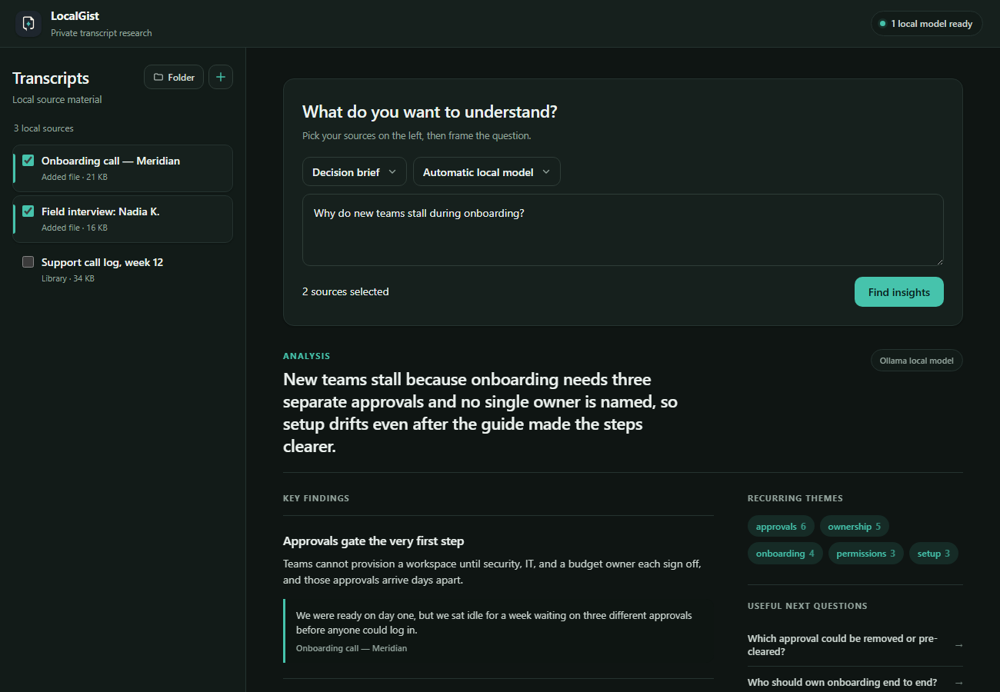

<div align="center">
  
  <h1>LocalGist</h1>
  <p><strong>Private, local-first transcript research for Windows.</strong></p>
  <p>Turn a folder of meeting and interview transcripts into evidence-backed answers, without sending a single word to the cloud.</p>

  <p>
    <a href="https://github.com/RohitWaghire/LocalGist/releases/latest"></a>
    
    
    
  </p>
</div>

---

## Overview

LocalGist is a Windows desktop app that reads your `.txt` and `.md` transcripts and answers questions about them with structured, quote-backed findings. Select your sources, frame a question, pick an analysis mode, and get back a synthesized overview, key findings with the exact supporting quotes, recurring themes, and suggested follow-up questions.

Everything runs on your machine. When a local [Ollama](https://ollama.com) model is available, LocalGist uses it to synthesize findings. When it is not, it falls back to a grounded extractive analysis, so the app is useful even fully offline.

<div align="center">
  
  <br>
  <em>Ask a question across selected transcripts and get findings with cited evidence. Light and dark themes follow your system.</em>
</div>

## Built with OpenAI Codex + GPT‑5.6

The core of LocalGist was built with **OpenAI Codex (GPT‑5.6)**. Codex designed and implemented:

- **The secure Electron shell** (`electron-main.js`, `electron-preload.js`) — context isolation, sandboxing, no Node integration in the renderer, a minimal `contextBridge` API, native file dialogs, the application menu, and IPC.
- **The local HTTP server and JSON API** (`insight-server.js`) — static serving plus `/api/status`, `/api/transcript`, and `/api/analyze`, with request-size and document-count limits and the local [Ollama](https://ollama.com) integration (`/api/generate`, JSON mode).
- **The analysis engine** (`insight-engine.js`) — the grounded extractive fallback (keyword extraction and question-overlap sentence ranking) plus the strict model-response parser that degrades gracefully.
- **The Playwright transcript fetcher** (`batch-transcripts.js`) and the **Node test suite** (engine, server, renderer, and desktop-contract tests).
- **The electron-builder NSIS packaging** for the Windows installer.

The interface was later refreshed as a final polish pass.

## Features

- **Local-first and private** — transcript content never leaves your computer. There is no account, no telemetry, and no hosted model API.
- **Evidence-backed findings** — every finding cites short, exact quotes and names the source transcript, so answers stay grounded in your material.
- **Four analysis modes** — reframe the same sources as a *Decision brief*, *Themes & patterns*, *Risks & objections*, or *Customer language*.
- **Bring your own model** — auto-detects local Ollama models and lets you pick one, or chooses automatically.
- **Always-on fallback** — a keyword and sentence-ranking engine produces a grounded read when no model is running.
- **Flexible import** — add files from the app, open the transcript folder, or drop `.txt` / `.md` files straight into it (up to 1 MB each).
- **System-aware light and dark themes** with a calm, focused interface.
- **Hardened Electron shell** — context isolation, sandboxing, and no Node integration in the renderer.

## Download and install

1. Open the [**latest release**](https://github.com/RohitWaghire/LocalGist/releases/latest).
2. Download **`LocalGist Setup 1.0.0.exe`**.
3. Run the installer. It lets you choose the install location and creates Start Menu and desktop shortcuts.
4. Launch **LocalGist**. A private transcript folder is created for you on first run.

> **SmartScreen note:** the installer is not signed with a commercial certificate, so Windows SmartScreen may show a warning. Choose **More info → Run anyway** to continue.

### Optional: enable AI synthesis with Ollama

LocalGist works without any model, but a local model produces richer, synthesized findings.

1. Install [Ollama](https://ollama.com/download) and pull a model, for example:
   ```bash
   ollama pull llama3.1
   ```
2. Start LocalGist. Detected models appear in the model dropdown and the status pill shows how many are ready.

By default LocalGist talks to Ollama at `http://127.0.0.1:11434`. Override it with the `OLLAMA_URL` environment variable if your endpoint differs.

## How it works

```
Electron shell (electron-main.js)
  └─ local HTTP server on 127.0.0.1 (insight-server.js)
       ├─ serves the UI (insights-public/)
       └─ JSON API: /api/status · /api/transcript · /api/analyze
            └─ analysis engine (insight-engine.js)
                 ├─ Ollama local model  → JSON synthesis, when available
                 └─ extractive fallback → keyword + question-overlap ranking
```

- The renderer is a static HTML/CSS/JS app and never has direct file-system or network access. It talks to the desktop only through a tiny preload bridge (`chooseTranscripts`, `openTranscriptFolder`, `onTranscriptImport`).
- Transcripts are stored in your user-data folder when packaged (`%APPDATA%/LocalGist/transcripts`) and in the project's `transcripts/` folder during development.
- Analysis is capped for safety (max 20 documents per run, per-document and total size limits) so large libraries stay responsive.

## Analysis modes

| Mode | Best for |
| --- | --- |
| **Decision brief** | A concise, decision-oriented read of what the sources imply. |
| **Themes & patterns** | Recurring topics and how they connect across transcripts. |
| **Risks & objections** | Concerns, blockers, and pushback surfaced from the material. |
| **Customer language** | The actual words people use, useful for messaging and research. |

## Privacy and security

- Transcript content is processed locally and is never uploaded.
- Model requests go only to your local Ollama endpoint; no third-party model API is called by the app.
- The Electron renderer runs with `contextIsolation: true`, `sandbox: true`, and `nodeIntegration: false`; external links open in your system browser rather than in-app.

## Development

**Prerequisites:** [Node.js](https://nodejs.org) 18+ · optional [Ollama](https://ollama.com) for AI synthesis · a Chromium/Edge browser for the renderer test.

```powershell
npm install           # install dependencies
npm run desktop       # launch the Electron app
npm run insights      # run just the web server (http://127.0.0.1:4173)
npm test              # node --test: engine, server, and a Playwright renderer test
npm run package:win   # build the NSIS installer into release/
```

**Environment variables**

| Variable | Default | Purpose |
| --- | --- | --- |
| `OLLAMA_URL` | `http://127.0.0.1:11434` | Local Ollama endpoint used for synthesis. |
| `INSIGHTS_PORT` | `4173` | Port for the standalone `npm run insights` server. |

### Bulk transcript fetching (optional)

`npm start` runs `batch-transcripts.js`, a [Playwright](https://playwright.dev) helper that pulls YouTube transcripts (via [tactiq.io](https://tactiq.io)) for URLs listed in `links.txt` and saves them into `transcripts/`. It rate-limits requests, tracks progress in `progress.json`, and records failures in `failures.csv`.

```powershell
npm start                    # process every link in links.txt
npm start -- --batch-size 10 # process only the next 10
npm start -- --headless      # run without a visible browser window
```

## Project layout

```
electron-main.js       Electron entry point, window, menu, IPC
electron-preload.js    Secure contextBridge API for the renderer
insight-server.js      Local HTTP server and JSON API
insight-engine.js      Extractive fallback + model response parsing
insights-public/       The desktop UI (index.html, styles.css, app.js)
batch-transcripts.js   Optional YouTube-transcript fetcher (Playwright)
test/                  Node test suite (engine, server, renderer, contract)
```

## Releasing

The installer is distributed as a GitHub Release asset rather than committed to the repository. To cut a new release:

```powershell
npm run package:win
gh release create v1.0.0 "release/LocalGist Setup 1.0.0.exe" --title "LocalGist v1.0.0" --notes "..."
```

## License

No license has been assigned yet, so all rights are reserved by the author. If you would like to use or contribute to LocalGist, please open an issue to discuss terms.
